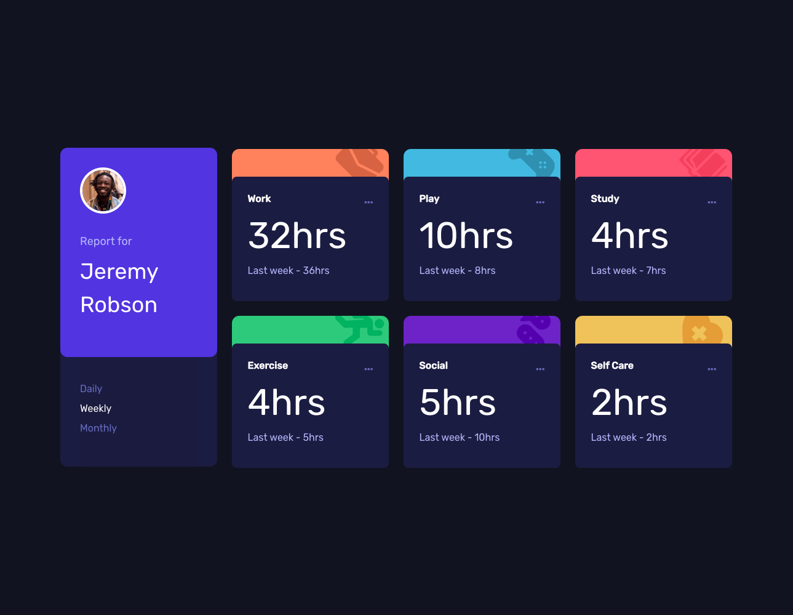

# Frontend Mentor - Time tracking dashboard solution

This is a solution to the [Time tracking dashboard challenge on Frontend Mentor](https://www.frontendmentor.io/challenges/time-tracking-dashboard-UIQ7167Jw). Frontend Mentor challenges help you improve your coding skills by building realistic projects. 

## Table of contents

- [Overview](#overview)
  - [The challenge](#the-challenge)
  - [Screenshot](#screenshot)
  - [Links](#links)
- [My process](#my-process)
  - [Built with](#built-with)
  - [What I learned](#what-i-learned)
  - [Continued development](#continued-development)
- [Author](#author)
- [Acknowledgments](#acknowledgments)


## Overview

### The challenge

Users should be able to:

- View the optimal layout for the site depending on their device's screen size
- See hover states for all interactive elements on the page
- Switch between viewing Daily, Weekly, and Monthly stats

### Screenshot



### Links

- Solution URL: [Solution](https://www.frontendmentor.io/solutions/responsive-time-tracking-dashboard-with-react-and-chakra-ui-utOsmaiis-)
- Live Site URL: [Time Tracking Dashboard](https://habit-timetracker-dashboard.netlify.app/)

## My process

### Built with


- Flexbox
- CSS Grid
- Mobile-first workflow
- [React](https://reactjs.org/) - JS library
- [Chakra-Ui](https://chakra-ui.com/) - Component Library

### What I learned


I learned a bit more about the useContext hook and how beneficial it is in terms of simplifying the delegation of different states and props to other components. I also became a lot more familiar with Chakra Ui and I love the ways in which it improves my workflow. I find that it makes building mobile-first responsive sites a lot more intuitive and faster too. 


```js
const TimePeriodContext = createContext();

export const TimePeriodProvider = ({ children }) => {
    const [ period, setPeriod ] = useState('weekly')
    const [ data, setData ] = useState(userData) 

    const handleDailyClick = () => {
        setPeriod('daily')
    }

    const handleWeeklyClick = () => {
        setPeriod('weekly')
    }

    const handleMonthlyClick = () => {
        setPeriod('monthly')
    }
}
```

```js

  <Flex
    borderRadius='xl'
    w={['327px', null, null, '255px']} 
    h={['203px', '203px', '203px', '518px']}
    direction='column'
    bgColor='#1C204B'
    mx='auto'
    >

    <Stack 
        borderRadius='xl'
        p='2rem' 
        bgColor='#5747EA'
        flex='2'
        direction={['row', null, null, 'column']}
        spacing={['1rem', null, null, '2rem']}
    >
        
            <Image 
                borderRadius='full'
                border='4px'
                borderColor='white'
                boxSize='75px' 
                objectFit='cover'
                src={avatar}
                alt='Jeremy Robson'
            />
  </Flex>
```


### Continued development

Going forward I want to shit my focus more towards becoming extremily comfortable with useEffect for getting my data straight from an API. Also get great at using reactRouter and Redux as well. I am excited to get started on my next project which will be a multipaged implementing most if not all of the aformentioned toolsets. 


## Author

- Website - [Sheelove Dol](https://www.sheelovedol.com)
- Frontend Mentor - [SudZero848](https://www.frontendmentor.io/profile/SudZero848)


